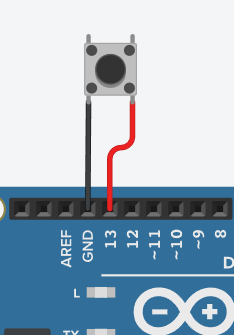
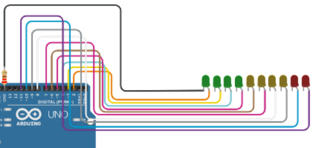
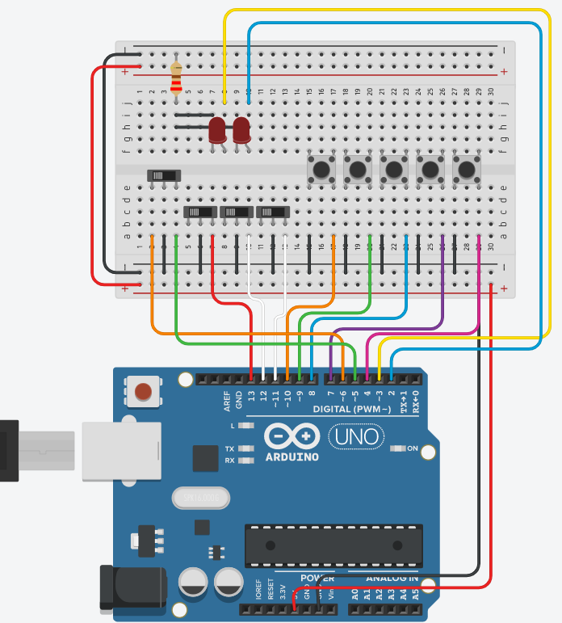

# SimRacingSetup

### Some programs to ease the making of a "DIY" sim racing setup 


## Objective

Create apps to use arduino uno as a interpreter for sim racing gadgets.

## Files

### HANDBRAKE Files  
```handbrake.ino``` - can be uploaded to arduino (uno). Reads the state of a button (INPUT_PULLUP enabled) connected on pin 13 and outputs a message on the serial port corresponding to the current state of the button  
```handbrake.py``` - reads the arduino uno serial port and whenever it detects an input, from the button connected to the arduino, simulates the keypress of the "p" key  

### REV LIGHTS Files:
```revLights.ino```  - can be uploaded to a arduino (uno). Used to light a series of LEDs connected from pin 2 to 11 (with proper resistors [330ohm])  
```revLights.py``` - used to select the serial port on which the arduino is connected. Sends info from Forza Horizon car's engine rpm to the arduino.  
```fdp.py``` - Class to interpret information outputed from Forza Horizon data out feature.  

### HANDBRAKE and REV LIGHTS Files
```handbrake_revLights.ino```  - can be uploaded to a arduino (uno). Used to light a series of LEDs connected from pin 2 to 11 and to read the state of a button (INPUT_PULLUP enabled) connected on pin 13.  
```handbrake_revLights.py``` - used to select the serial port on which the arduino is connected. Reads data from the arduino and presses "p" key on the keyboard. Currently the program reads data from Forza Horizon 4 and 5 and lights 10 LEDs illustrating the car's engine rpm.  
```fdp.py``` - Class to interpret information outputed from Forza Horizon data out feature.  
```pcars folder``` - Package with Project cars's support class and methods.

### BUTTON BOX Files
```buttonBox.ino``` - can be uploaded to arduino (uno). Used to read the state of a series of buttons and switches and write their vaues on the serial channel.  
```buttonBox.py``` - used to communicate with the arduino. Reads the inputs and simulates the press of the corresponding keyboard keys (numbers 0 -> 9 and "p" and "o" keys)  


## References

**FORZA GAMES** - [Repo Link](https://github.com/nettrom/forza_motorsport) - repository with some porgrams to get data from the forza data out udp feature.  
**PROJECT CARS** - [Repo Link](https://github.com/jamesremuscat/pcars) - repository with some programs to get data from the PC's games.  


## Phisical components

### Handbrake
A misc between Mecano parts, a wooden broomstick segment and a bycicle ruber handle and a pushbutton.  
  

### Rev Lights
4 green LEDs, 4 yellow LEDs, 2 red LEDs, a 220 ohm resistor. Mounted into a black painted pine wood segment.  
  

### Button Box
A set of 3 lever switches, 5 pushbuttons and a "normal" switch. Mounted on a black painted pine wood box.  
  
  
### Handbrake and Rev Lights
Combine the two connections in the arduino.  

**NOTE:** *I will not post any pictures because my craftsmanship is terrible :(*  

## Configuring Forza Horizon 4 and 5 data out
1. In the HUD options scroll down and tick "Data out" to on.
2. Set the IP address to your computer's IP address (ipv4).
3. Set the port to 5607.
4. Start the python app (revLights.py or handbrake_revLights.py)
5. Configure serial port*
6. Enjoy

\*IF YOU DONT KNOW WHICH SERIAL PORT TO CHOSE, OPEN THE APP WITHOU CONNECTING ARDUINO TO THE USB PORT, THEN CONNECT IT AND OPEN THE APP. CHOSE THE PORT THAT SHOWED UP.