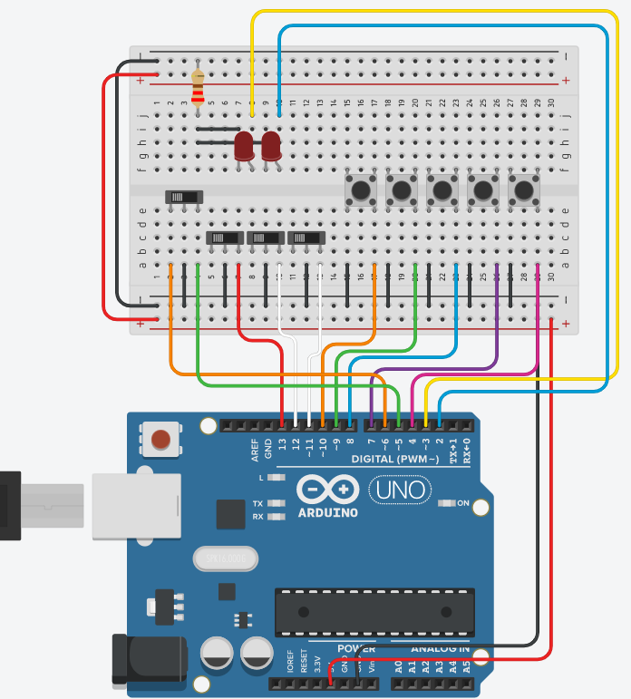

# Button Box

A box with a lot of switches that simulate keyboard keypresses so that you can sit confortably in your chair while driving and pressing buttons.  

# Instalation

1. Upload the buttonBox.ino to your **arduino uno**
2. Run buttonBox.py

  