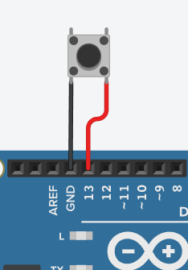

# Handbrake and Rev Lights

An arduino program to controll LEDs and read data from a button, and a python app to read UDP data from racing games and send it to the arduino.  

# Instalation

1. Download the folder contents.
2. Upload the handbrake_revLights.ino to the **arduino uno**
3. Run the main.py file

# Diagrams

## Rev Lights REQUIRED
  

## Handbrake (OPTIONAL)
  

# References

**FORZA GAMES** - [Repo Link](https://github.com/nettrom/forza_motorsport) - repository with some porgrams to get data from the forza data out udp feature.  
**PROJECT CARS** - [Repo Link](https://github.com/jamesremuscat/pcars) - repository with some programs to get data from the PC's games.  
**F1 2020** - [Repo Link](https://github.com/ChadRMacLean/PyF1Telemetry) - repository with some programs to get data from the F1 2020 and above games.  

# Configurations

## Configuring Forza Horizon 4 and 5 data out
1. In the HUD options scroll down and tick "Data out" to on.
2. Set the IP address to your computer's IP address (ipv4).
3. Set the port to 5607.

## Configuring PC2 udp telemetry
1. In the options menu select system
2. In shared memory select ***Project cars 2***

## Configuring F1 2021 udp telemetry

1. In the settings menu open "Telemetry"
2. Select udp telemetry to ***on***
3. Set the UDP port to ***5607***
4. Set the format to ***2020***

\*IF YOU DONT KNOW WHICH SERIAL PORT TO CHOSE, OPEN THE APP WITHOUT CONNECTING ARDUINO TO THE USB PORT, THEN CONNECT IT AND OPEN THE APP. CHOSE THE PORT THAT SHOWED UP.